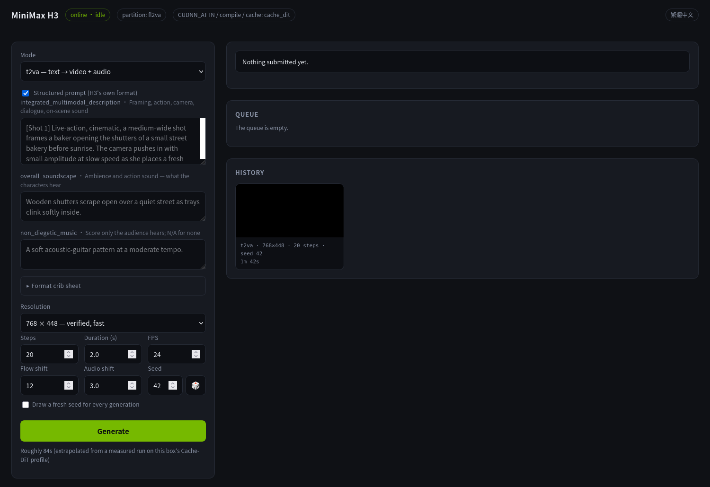

# h3-ui

**English** | [繁體中文](README.zh-TW.md)

A thin browser frontend for video generation on a [vLLM-Omni](https://github.com/vllm-project/vllm-omni) server.

One file, standard library only, no build step. Point it at a running server and open a browser.



It exists because talking to `/v1/videos/sync` by hand is tedious: multipart bodies, base64 attachments, an API key you don't want in your shell history, and generations long enough that a dropped connection loses the result. This sits in front of that and keeps the key server-side.

## What it does

- **Text, first-frame, and reference conditioning** — the task list is read from the served checkpoint, so the UI matches whatever partition is loaded rather than offering options the server will reject.
- **Attachment rules enforced before submitting** — each task states what it accepts, and the form refuses mismatched combinations instead of letting the server 400.
- **A real queue** — submit as many jobs as you like without waiting. A single worker drains them in submission order, so you can line up a batch and walk away. Queued jobs can be cancelled; running ones can't, because the upstream call is synchronous and already on the GPU.
- **Jobs survive the page** — generation runs server-side against a job id, so closing the tab or losing Wi-Fi doesn't kill a ten-minute render. The finished video appears whenever you come back.
- **Reproducible by default** — every result writes a sidecar JSON with the exact parameters beside the video.
- **Random seeds** — 🎲 draws one on demand; the checkbox draws a fresh one per generation. Either way the drawn value is written into the seed box and shown on completion, so a lucky result is never lost to a number you can't recover.
- **Structured prompts** — H3 expects three named sections rather than free text. The form gives you each one, with a format crib sheet, and builds the FL2VA alignment line from the duration you set so its timestamp can't drift out of sync. Plain text still works if you'd rather write it yourself.
- **Delete what didn't work** — trial runs and failures can be removed from the history, video and sidecar together.

## Requirements

- Python 3.10+ — standard library only, nothing to install
- A reachable vLLM-Omni server serving a video model

## Setup

```sh
cp .env.example .env
$EDITOR .env          # set H3_API_BASE, and H3_API_KEY if the server needs one
python3 server.py
```

Then open the address it prints.

If you run the [MiniMax-H3-DGX-Spark](https://github.com/joeynyc/MiniMax-H3-DGX-Spark) deployment repo, its `.env` is picked up automatically and a local one is optional.

### Configuration

Resolved in order: process environment → `.env` → default.

| Variable | Default | Meaning |
|---|---|---|
| `H3_API_BASE` | `http://127.0.0.1:8000` | vLLM-Omni base URL (a trailing `/v1` is stripped) |
| `H3_API_KEY` | *(empty)* | Sent as `Authorization: Bearer` when set |
| `H3_UI_HOST` | `127.0.0.1` | UI bind address |
| `H3_UI_PORT` | `8080` | UI port |
| `H3_UI_ENV_FILE` | *(auto)* | Explicit path to a `.env` |

## Language

The interface comes in English and Traditional Chinese, chosen from the browser:
**Traditional Chinese locales (`zh-TW` / `zh-Hant` / `zh-HK` / `zh-MO`) get Chinese;
everything else — `zh-CN` included — gets English.** The link in the header switches
by hand, and the choice is remembered in that browser's `localStorage`.

Server-side error messages follow the same choice: the page sends `X-Lang` with every
API call and the server falls back to `Accept-Language` when it is absent, so `curl`
gets messages in its own locale too.

The Chinese page looks like [this](docs/ui-zh.png).

## Security

**This process holds your API key and will proxy whatever a browser asks of it.** There is no authentication on the UI itself — that is deliberate for a loopback tool, and it is exactly why the default bind is `127.0.0.1`.

Setting `H3_UI_HOST` to a LAN address hands your API key's capabilities to everyone who can reach that port. Do it only on a network you trust, and prefer an SSH tunnel if you just need it from another machine:

```sh
ssh -L 8080:127.0.0.1:8080 user@gpu-box
```

Deleting a result unlinks it immediately. There is no trash, and the browser's confirm dialog is the only thing between a click and a gone file.

## Usage notes

**Queue.** Submitting adds to the queue and returns its position; the form stays usable so you can queue several variations at once. The queue panel shows what's waiting, what's running with elapsed against estimated time, and lets you cancel anything that hasn't started.

**Reproducing a result.** Every `media/*.mp4` has a `.mp4.json` beside it:

```json
{
  "task": "t2va",
  "prompt": "Rain on a window at night, soft patter.",
  "width": 768, "height": 448,
  "steps": 20, "duration": 2.0, "fps": 24,
  "flow_shift": 12.0, "audio_flow_shift": 3.0,
  "seed": 43538620,
  "elapsed": 118.6
}
```

Paste those values back into the form — with the random checkbox off — and you get the same video.

**Estimates** are extrapolated from one measured run, scaling with `width × height × steps × duration`. Treat them as an order of magnitude, not a promise; caching and step-time drift move the real number around.

## HTTP API

The browser UI is just a client of this. Anything it does, you can script.

| Method | Path | Purpose |
|---|---|---|
| `GET` | `/api/status` | Upstream reachability, partition, task list, queue depth |
| `POST` | `/api/generate` | Queue a job; returns `{id, position}` |
| `GET` | `/api/jobs` | Whole queue plus recent finished jobs |
| `GET` | `/api/job/<id>` | One job's state |
| `POST` | `/api/job/<id>/cancel` | Cancel a queued job (409 if it already started) |
| `GET` | `/api/history` | Completed results with their parameters |
| `DELETE` | `/api/history/<file>` | Delete a result and its sidecar |
| `GET` | `/media/<file>` | The video itself |

Every endpoint accepts `X-Lang: en` or `X-Lang: zh` to pick the language of its error
messages; without it, `Accept-Language` decides.

### Prompt format

H3 reads three named sections, [documented upstream](https://github.com/MiniMax-AI/MiniMax-H3/tree/main/skills/h3-prompt-writing). Send them as `description`, `soundscape`, and `music` and they are assembled into H3's field names:

```text
integrated_multimodal_description: [Shot 1] Live-action, cinematic, a medium-wide shot frames…

overall_soundscape: Wooden shutters scrape open over a quiet street…

non_diegetic_music: A soft acoustic-guitar pattern at a moderate tempo.
```

`overall_soundscape` is what the characters can hear; `non_diegetic_music` is score only the audience hears — `N/A` for none. Shots are `[Shot 1]`, then `[Shot 2] At 00:03.500, the camera cuts to…`. Camera moves have a fixed vocabulary (`Push In`, `Truck Left`, `Arc Shot`, …) optionally qualified `with small amplitude` / `at slow speed`. Dialogue is `<d>[English] …</d>` with the speaker tagged `(S1)`.

For `fl2va` the guide also wants a leading line stating where each reference picture lands on the timeline. It's generated from `duration` and the last `[Shot N]` in your description, so the timestamp can't disagree with what you actually asked for:

```text
How the reference pictures align with the target video — Picture 1 (from Shot 1) aligns with the
0.00-second mark of the target video; Picture 2 (from Shot 1) aligns with the 8.00-second mark…
```

FL2VA prefers a single shot so the model interpolates continuously between the two frames.

Sending a plain `prompt` instead skips all of this and goes upstream unchanged.

### Request body

`POST /api/generate` takes JSON. A negative or absent `seed` means "draw one":

```sh
curl -X POST localhost:8080/api/generate -H 'Content-Type: application/json' -d '{
  "task": "t2va",
  "prompt": "Rain on a window at night, soft patter.",
  "width": 768, "height": 448,
  "steps": 20, "duration": 2.0, "fps": 24,
  "flow_shift": 12, "audio_flow_shift": 3.0,
  "seed": -1,
  "attachments": {}
}'
```

Attachments are data URLs: `{"image": "data:image/png;base64,..."}`, or `{"videos": [...]}` for reference conditioning.

## Scope

The server contract is vLLM-Omni's `POST /v1/videos/sync`. The **task vocabulary** (`t2va`, `fl2va`, `ref2va`) and the partition probe that reads `_minimax_h3` from `model_index.json` are MiniMax-H3 specific — a different video model on the same server needs those two touched, but nothing about the transport or the job handling changes. There is no dependency on DGX Spark or any particular GPU.

Image generation is **not** implemented. vLLM-Omni does expose `/v1/images/generations` and `/v1/images/edits`, so adding it is a matter of a task mode and a shorter result pane rather than new plumbing — whether it produces anything depends on the model actually loaded.

Other things it deliberately doesn't do: no user accounts, no multi-GPU scheduling, no database. Jobs live in memory, so a restart forgets the queue — finished videos are on disk and survive.

## Project layout

```
server.py       everything: HTTP handler, queue worker, and the page itself
.env.example    configuration template
docs/           interface screenshots
media/          generated videos and their sidecar JSON (gitignored)
```

## A note on long generations

vLLM-Omni bounds the wait for a finished step's background copy with `_ASYNC_OUTPUT_TIMEOUT`, which upstream sets to 30 s. If a single denoise step runs longer than that, the output future is cancelled and the server's result-pump thread dies — after which `/health` keeps answering 200 while no request ever returns again. High step counts on long durations reach that easily: 50 steps at 4 s ran 44–48 s per step on the box this was written against.

Reported as [vllm-project/vllm-omni#5821](https://github.com/vllm-project/vllm-omni/issues/5821), with a build-time fix in [joeynyc/MiniMax-H3-DGX-Spark#4](https://github.com/joeynyc/MiniMax-H3-DGX-Spark/pull/4). Worth patching before you push step counts up; this frontend can't work around it.

## License

Apache-2.0
