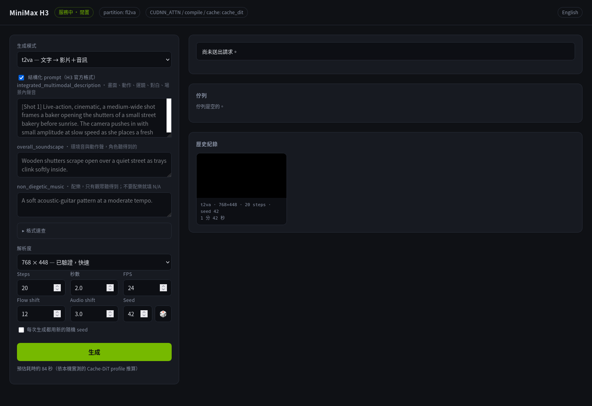

# h3-ui

[English](README.md) | **繁體中文**

在 [vLLM-Omni](https://github.com/vllm-project/vllm-omni) 伺服器上生成影片的輕量瀏覽器前端。

單一檔案、只用標準函式庫、不需編譯。指向一台執行中的伺服器，然後打開瀏覽器就能用。



它存在的理由是：手動對 `/v1/videos/sync` 送請求很煩，要處理 multipart 的 body、base64 的附件、一把你不想留在 shell 歷史裡的 API key，以及長到連線一斷就前功盡棄的生成時間。這支程式擋在前面，並把金鑰留在伺服器端。

## 它能做什麼

- **文字、首格圖片、參考條件三種條件模式**：任務清單直接讀自載入中的 checkpoint，所以 UI 會對齊實際載入的 partition，不會給出伺服器根本會拒絕的選項。
- **送出前就擋掉不合法的附件組合**：每個任務都標明自己接受什麼，表單會直接拒絕不相符的組合，而不是讓伺服器回 400。
- **真正的佇列**：想送幾個就送幾個，不必等。每個設定的上游各有一個 worker，依送出順序逐一處理，所以你可以排好一批就走開。排隊中的工作可以取消；正在跑的不行，因為上游呼叫是同步的，而且已經在 GPU 上了。
- **工作不隨頁面消失**：生成是在伺服器端對著一個 job id 進行，所以關掉分頁或斷線都不會殺掉一個十分鐘的算圖。你回來時完成的影片就在那裡。
- **預設可重現**：每個結果都會在影片旁寫一份記錄完整參數的 JSON。
- **隨機種子**：🎲 隨手抽一個；勾選核取方塊則每次生成都抽新的。無論哪種方式，抽到的值都會寫回 seed 欄位並在完成時顯示，所以幸運的結果不會因為記不住數字而消失。
- **結構化 prompt**：H3 要的是三個具名區塊而不是自由文字。表單為每個區塊各留一格，附上格式速查，並依你設定的秒數自動組出 FL2VA 的對齊指令，讓時間戳不會跟表單對不上。你想自己寫的話，純文字一樣可用。
- **刪掉不成功的結果**：試拍與失敗品可以從歷史紀錄移除，影片與參數檔一起走。

## 需求

- Python 3.10+，只用標準函式庫，不必安裝任何東西
- 一台跑著影片模型、連得到的 vLLM-Omni 伺服器

## 伺服器相容性

h3-ui 講兩種請求契約，由 `H3_SERVER_CONTRACT` 決定。

`current`（預設）是 2026-08-22 nightly 之後 vLLM-Omni 要的：

- 輸出時長必須介於 4 到 15 秒。送 2 秒會拿到
  `500 MiniMax H3 output duration must be in [4, 15] seconds`，所以時長欄位在這裡就先設限。
- `t2va` 必須明確指定 `aspect_ratio`，限 `21:9`、`16:9`、`4:3`、`1:1`、`3:4`、`9:16`
  其中之一。表單會送出最接近你所設畫布的那個名稱，畫布仍然由 `width` 與 `height` 決定，
  上游的 recipe 自己也是把 960x576 配 `16:9`。`fl2va` 跟隨輸入圖，`ref2va` 預設 16:9，
  兩者都不送這個欄位。

`legacy` 是 2026-08-02 發布的 `minimax-h3` image：只要畫布就夠，時長也沒有下限。
還在跑那個 image 就設這個值。

### FastH3

[FastH3](https://haoailab.com/blogs/fasth3-preview/) 是 FastVideo 對 MiniMax-H3 做的
四步 DMD2 學生模型。vLLM-Omni 是在載入時把 `--lora-path` 指的 adapter 融進 checkpoint，
不是可以逐請求切換的 LoRA，所以融合過的伺服器是換了一套請求契約，不是多了一個選項：

- `num_inference_steps` 必須剛好是 4。
- 只提供 `t2va`，因為 preview v1 只蒸餾了這個任務。
- `flow_shift` 與 `audio_flow_shift` 由融合的排程擁有。伺服器只接受與 checkpoint 相同的值，
  其他一律回 `500 FastH3 requires flow_shift=12, got 8`。h3-ui 選擇整個不送，而不是把表單
  預設值回聲出去，因為這是唯一不可能與這個行程看不到的排程起衝突的做法。

線路上沒有任何地方會說 adapter 已經融合：`/v1/models` 不變，`model_index.json` 也不變。
所以 h3-ui 偵測不到，必須用 `H3_LORA_PATH`（與伺服器同一個值）或 `H3_FASTH3` 明講。
一旦告知，步數欄會鎖在 4、兩個 shift 欄會消失、模式只剩 `t2va`，而且每個結果都會記下
是哪個 adapter 產生的。

在一台 GB10、線上 FP8、全計算、960x576、4.4 秒、seed 1101 的條件下，這個 adapter 把
50 步的 1034 秒縮到 114 秒，768x448 則是 63 秒。

本身就是蒸餾版的 checkpoint 不需要任何設定：它會在 `_minimax_h3` 裡宣告自己的排程，
一樣會被鎖住。

多台上游時這是全有全無。設定是行程級的，無法逐台檢查，所以每一台都必須以 `--lora-path`
啟動。混搭會不對稱地壞掉：融合的那台會直接拒絕 20 步請求，沒有 adapter 的那台則會接受
4 步請求並回傳糊掉的畫面。

### Turbo，以及另一種 adapter

把蒸餾 adapter 掛到 H3 前面有兩種做法，行為差異大到 h3-ui 必須當成兩個功能處理。

**FastH3 是融合的**，在伺服器啟動時併進 checkpoint，所以它是伺服器的屬性：每個請求都是
四步、都只有 t2va，沒有東西可以切換。表單會自我鎖定就是這個原因。

**Turbo LoRA 是預載但未啟用。** 伺服器以 `--lora-backend peft --lora-path` 啟動後，
vLLM-Omni 會讓它常駐但不生效，由每個請求自己決定：指名它就套用，不指名就用原版
checkpoint 以你要的步數算圖。h3-ui 把這件事做成勾選框，勾了就套用 adapter 自己的取樣設定，
也就是界出四次去噪的五個 sigma 點，以及 video shift 6 而不是 checkpoint 的 12。

把 `H3_REQUEST_LORA_PATH` 指向伺服器拿到的同一個檔（用伺服器看得到的路徑），勾選框就會出現。
上游只支援一個檔案：

```
lightx2v/Minimax-h3-Turbo/minimax_h3_fl2v_turbo_4step_v1.0_768p_bf16.safetensors
```

同一個 repo 的 8 步、ComfyUI 格式、Ref2VA 與 v1.1 都不支援，也不支援預先融合或疊多個。

兩者互斥：融合過的伺服器會拒收同時指名 LoRA 的請求，所以 h3-ui 會直接擋下並說明是哪個
adapter 擋路，而不是讓上游回一個 500。

### 重新校準時間估算

產生按鈕下方的估算來自一個成本模型，以 `X = 百萬畫素 × 輸出秒數` 表示：

```
t = H3_EST_FIXED_SECONDS
  + H3_EST_PER_MPXS       * X
  + H3_EST_PER_MPXS_STEP  * X * 步數
  + H3_EST_PER_MPXS2_STEP * X^2 * 步數
```

第二項是隨輸出畫素但不隨步數變化的成本，也就是 VAE 解碼與封裝。第三項是每個去噪步驟中
對 token 數呈線性的部分，第四項是注意力，對 token 數是平方。H3 的 token 數正比於
`畫素 / 32^2` 乘上 `影格 / 4`，所以平方的是 `X`，不是畫素或時長各自。

預設值是在一台 DGX Spark（GB10）上以 11 次實測算圖擬合出來的：線上 FP8、cuDNN 注意力、
regional compile、未開 Cache-DiT，涵蓋 768x448 到 1344x768、4.4 秒到 12 秒、4 步到 50 步。
leave-one-out 最差誤差 8.4%，平均 3.8%：

| 畫布 | 步數 | 時長 | 實測 | 模型 |
| --- | ---: | ---: | ---: | ---: |
| 768x448 | 4 | 4.4 秒 | 62.6 秒 | 63 秒 |
| 768x448 | 4 | 8.0 秒 | 131.1 秒 | 126 秒 |
| 768x448 | 4 | 12.0 秒 | 211.9 秒 | 209 秒 |
| 768x448 | 10 | 4.4 秒 | 130.2 秒 | 130 秒 |
| 768x448 | 20 | 4.4 秒 | 227.1 秒 | 242 秒 |
| 960x576 | 4 | 4.4 秒 | 113.9 秒 | 109 秒 |
| 960x576 | 4 | 8.0 秒 | 231.6 秒 | 228 秒 |
| 960x576 | 20 | 4.4 秒 | 413.7 秒 | 427 秒 |
| 960x576 | 50 | 4.4 秒 | 1034.5 秒 | 1025 秒 |
| 1344x768 | 4 | 4.4 秒 | 240.9 秒 | 236 秒 |
| 1344x768 | 4 | 8.0 秒 | 534.8 秒 | 538 秒 |

這些常數屬於那個 profile，不屬於 h3-ui。換硬體或把 Cache-DiT 開回來就要重新擬合：量幾次
分別變動畫布、時長與步數的算圖，再解出三個係數即可。常數項試過並被否決，因為強制為零時對
held-out 點的預測更好；`H3_EST_FIXED_SECONDS` 留給真的需要它的機器。

## 安裝設定

```sh
cp .env.example .env
$EDITOR .env          # 設定 H3_API_BASE；伺服器需要金鑰的話再設 H3_API_KEY
python3 server.py
```

然後打開它印出來的網址。

如果你用的是 [MiniMax-H3-DGX-Spark](https://github.com/joeynyc/MiniMax-H3-DGX-Spark) 這套部署 repo，它的 `.env` 會被自動採用，本地的 `.env` 可有可無。

### 設定項目

解析順序：行程環境變數 → `.env` → 預設值。

| 變數 | 預設值 | 意義 |
|---|---|---|
| `H3_API_BASES` | *(未設定)* | 多個 vLLM-Omni base URL，逗號分隔。優先於 `H3_API_BASE` |
| `H3_API_BASE` | `http://127.0.0.1:8000` | vLLM-Omni base URL，也接受逗號分隔（結尾的 `/v1` 會被去掉） |
| `H3_API_KEY` | *(空)* | 有設定時以 `Authorization: Bearer` 送出 |
| `H3_UI_HOST` | `127.0.0.1` | UI 綁定位址 |
| `H3_UI_PORT` | `8080` | UI 連接埠 |
| `H3_UI_ENV_FILE` | *(自動)* | 明確指定 `.env` 的路徑 |
| `H3_SERVER_CONTRACT` | `current` | `current` 或 `legacy`，見「伺服器相容性」 |
| `H3_BACKEND_KIND` | `vllm-omni` | 每個上游跑的是哪種伺服器：`vllm-omni` 或 `fastvideo`。給一個值就套用到全部；給逗號清單則依 `H3_API_BASES` 的順序對應 |
| `H3_FASTVIDEO_MODEL` | `fasth3` | FastVideo 上游對外宣告的模型別名。請求指名其他模型會被拒絕 |
| `H3_REQUEST_LORA_PATH` | *(空)* | 預載的 LoRA，用伺服器看得到的路徑。有值勾選框才會出現 |
| `H3_REQUEST_LORA_NAME` | `turbo` | 請求 `lora` 欄位裡送的名稱 |
| `H3_REQUEST_LORA_LABEL` | `Turbo, 4 denoiser steps` | 勾選框文字 |
| `H3_REQUEST_LORA_STEPS` | `5` | adapter 要的 sigma 點數 |
| `H3_REQUEST_LORA_FLOW_SHIFT` | `6` | adapter 蒸餾時的 video shift |
| `H3_REQUEST_LORA_AUDIO_SHIFT` | `3.0` | audio shift |
| `H3_REQUEST_LORA_SCALE` | `1.0` | LoRA 強度 |
| `H3_REQUEST_LORA_TASKS` | `t2va,fl2va` | adapter 提供的任務 |
| `H3_LORA_PATH` | *(空)* | 伺服器啟動時用的 adapter。有值即視為 FastH3 已融合 |
| `H3_FASTH3` | *(未設定)* | 覆寫：布林開關，或融合的 adapter 釘死的步數。`0` 是強制關閉 |
| `H3_EST_FIXED_SECONDS` | `0` | 時間估算的常數項 |
| `H3_EST_PER_MPXS` | `11.88` | 每「百萬畫素 × 秒」的成本，與步數無關 |
| `H3_EST_PER_MPXS_STEP` | `6.05` | 每步中對 token 數線性的部分 |
| `H3_EST_PER_MPXS2_STEP` | `0.88` | 每步中的注意力成本，對 token 數平方 |

## 多台主機

把 `H3_API_BASES` 設成逗號分隔的清單，讓多台機器各自跑自己的 vLLM-Omni，共用同一條佇列：

```
H3_API_BASES=http://spark-a.lan:8002,http://spark-b.lan:8002
```

`H3_API_BASE` 用逗號分隔也可以，但這個檔案若與部署 repo 共用，請用複數的那個：
部署腳本把 `H3_API_BASE` 當成單一 URL 拿去組健康檢查位址，寫成清單會讓它們壞掉。

每個後端有自己的 worker，全部從同一條 FIFO 取件，所以哪台先空出來就接下一個工作，
送出的順序仍然是開始執行的順序。結果透過 HTTP 收回，寫在跑 UI 的那台，所以作品集
仍然集中在一處。連不上的機器會被排除在輪替之外，而不是拿到工作才失敗；標題列會顯示
有幾台在忙、有幾台連不上。

這不會讓單一支影片變快。模型無法跨機器：diffusion 執行器只會在本機開行程，沒有跨機的
tensor 或 sequence 平行可用。能拿到的是每台同時各跑一支。


## 語言

介面有英文與繁體中文兩種，依瀏覽器語言自動選擇：**繁體中文語系（`zh-TW` / `zh-Hant` / `zh-HK` / `zh-MO`）看到中文版，其餘語系（包含 `zh-CN`）看到英文版。** 標頭右上角的連結可以手動切換，選擇會記在該瀏覽器的 `localStorage` 裡。

伺服器回傳的錯誤訊息也跟著同一套語言：頁面會在每個 API 請求帶上 `X-Lang`，沒有這個標頭時則回頭看 `Accept-Language`，所以用 `curl` 直接呼叫也會拿到符合你語系的訊息。

英文版介面長[這樣](docs/h3_ui.jpg)。

## 安全性

**這個行程握有你的 API key，而且瀏覽器要求什麼它就代理什麼。** UI 本身沒有任何驗證。對一個 loopback 工具來說這是刻意的，也正是預設綁在 `127.0.0.1` 的原因。

把 `H3_UI_HOST` 設成 LAN 位址，等於把你 API key 的所有權限交給任何連得到那個埠的人。只在你信任的網路上這麼做；如果只是想從另一台機器用，優先選 SSH tunnel：

```sh
ssh -L 8080:127.0.0.1:8080 user@gpu-box
```

刪除結果會立刻 unlink。沒有垃圾桶，瀏覽器的確認對話框是點下去與檔案消失之間唯一的東西。

## 使用說明

**佇列。** 送出後會加入佇列並回報排隊位置；表單維持可用，所以你可以一次排好幾種變化。佇列面板會顯示等待中的項目、正在跑的項目（已耗時對照預估時間），並且可以取消任何還沒開始的工作。

**重現一個結果。** 每個 `media/*.mp4` 旁邊都有一份 `.mp4.json`：

```json
{
  "task": "t2va",
  "prompt": "Rain on a window at night, soft patter.",
  "width": 768, "height": 448,
  "steps": 20, "duration": 2.0, "fps": 24,
  "flow_shift": 12.0, "audio_flow_shift": 3.0,
  "seed": 43538620,
  "elapsed": 118.6
}
```

FastH3 的結果會帶 `"adapter": "fasth3 (dense-datafree)"`，而不是兩個 shift 欄位，
因為那兩個本來就沒有出現在請求裡。

把這些值貼回表單，並關掉隨機種子的核取方塊，就會得到同一支影片。

**預估時間**來自在量測那台機器上擬合的成本模型，細節見[重新校準時間估算](#重新校準時間估算)。當時 held-out 誤差在 9% 以內，但那組常數描述的是那台機器與那個 profile；換到別台就把數字當成數量級看。

## HTTP API

瀏覽器 UI 只是這組 API 的一個客戶端。它能做的事，你都可以用腳本做。

| 方法 | 路徑 | 用途 |
|---|---|---|
| `GET` | `/api/status` | 上游是否可連線、partition、任務清單、佇列深度 |
| `POST` | `/api/generate` | 排入一個工作；回傳 `{id, position}` |
| `GET` | `/api/jobs` | 整個佇列，加上最近完成的工作 |
| `GET` | `/api/job/<id>` | 單一工作的狀態 |
| `POST` | `/api/job/<id>/cancel` | 取消排隊中的工作（已開始則回 409） |
| `GET` | `/api/history` | 已完成的結果與它們的參數 |
| `DELETE` | `/api/history/<file>` | 刪除一個結果與它的參數檔 |
| `GET` | `/media/<file>` | 影片本身 |

所有端點都接受 `X-Lang: en` 或 `X-Lang: zh` 來指定錯誤訊息的語言；沒帶的話會依 `Accept-Language` 判斷。

### Prompt 格式

H3 讀的是三個具名區塊，[官方文件在此](https://github.com/MiniMax-AI/MiniMax-H3/tree/main/skills/h3-prompt-writing)。以 `description`、`soundscape`、`music` 送出，它們會被組成 H3 的欄位名稱：

```text
integrated_multimodal_description: [Shot 1] Live-action, cinematic, a medium-wide shot frames…

overall_soundscape: Wooden shutters scrape open over a quiet street…

non_diegetic_music: A soft acoustic-guitar pattern at a moderate tempo.
```

`overall_soundscape` 是角色聽得到的聲音；`non_diegetic_music` 是只有觀眾聽得到的配樂，不要配樂就填 `N/A`。鏡頭寫成 `[Shot 1]`，接著 `[Shot 2] At 00:03.500, the camera cuts to…`。運鏡有固定詞彙（`Push In`、`Truck Left`、`Arc Shot`…），可加 `with small amplitude` / `at slow speed` 修飾。對白寫成 `<d>[English] …</d>`，說話者標 `(S1)`。

fl2va 還需要在最前面加一行，說明每張參考圖片落在時間軸的哪裡。這行是從 `duration` 與 description 裡最後一個 `[Shot N]` 產生的，所以時間戳不可能跟你實際要求的秒數不一致：

```text
How the reference pictures align with the target video — Picture 1 (from Shot 1) aligns with the
0.00-second mark of the target video; Picture 2 (from Shot 1) aligns with the 8.00-second mark…
```

FL2VA 偏好單一鏡頭，好讓模型在兩張圖之間連續內插。

改送純文字的 `prompt` 則會跳過上述全部，原封不動送往上游。

### 請求內容

`POST /api/generate` 收 JSON。`seed` 為負數或不給就代表「幫我抽一個」：

```sh
curl -X POST localhost:8080/api/generate -H 'Content-Type: application/json' -d '{
  "task": "t2va",
  "prompt": "Rain on a window at night, soft patter.",
  "width": 768, "height": 448,
  "steps": 20, "duration": 4.0, "fps": 24,
  "flow_shift": 12, "audio_flow_shift": 3.0,
  "seed": -1,
  "attachments": {}
}'
```

附件是 data URL：`{"image": "data:image/png;base64,..."}`，參考影片條件則用 `{"videos": [...]}`。

對著 FastH3 伺服器時，`steps` 必須是 `4`，兩個 shift 欄位都要省略；不符合就會拿到一個
說明違反哪條規則的 400，而不是被默默改寫成一次 sidecar 會記錯的算圖。

## 範圍

伺服器端的契約是 vLLM-Omni 的 `POST /v1/videos/sync`。**任務詞彙**（`t2va`、`fl2va`、`ref2va`）以及從 `model_index.json` 讀 `_minimax_h3` 的 partition 探測是 MiniMax-H3 專屬的：同一台伺服器換一個影片模型，要動的是這兩處，傳輸與工作處理則完全不用改。它不依賴 DGX Spark 或任何特定 GPU。

圖片生成**未**實作。vLLM-Omni 確實有 `/v1/images/generations` 與 `/v1/images/edits`，所以要加的話是多一個任務模式與一塊比較短的結果面板，而不是新的管線；至於能不能生出東西，取決於實際載入的模型。

其他刻意不做的事：沒有使用者帳號、沒有資料庫，也沒有比「把下一個排隊工作交給任一個空閒上游」更聰明的排程。工作存在記憶體裡，所以重啟會忘掉佇列。完成的影片在磁碟上，會留著。

## 專案結構

```
server.py       全部：HTTP handler、佇列 worker，以及頁面本身
.env.example    設定範本
docs/           介面截圖
media/          生成的影片與它們的參數 JSON（已 gitignore）
```

## 關於長時間生成

vLLM-Omni 用 `_ASYNC_OUTPUT_TIMEOUT` 限制等待某一步背景複製完成的時間，上游原本把它寫死成 30 秒。如果單一 denoise 步驟跑得比這久，輸出的 future 會被取消，伺服器的 result-pump 執行緒會死掉，之後 `/health` 還是回 200，但再也不會有任何請求回來。長秒數配高 step 數很容易踩到：在寫這份東西的機器上，50 steps、4 秒的組合每步要跑 44 到 48 秒。

**逾時這一半上游已經修好。** [#6255](https://github.com/vllm-project/vllm-omni/pull/6255) 在 2026-08-22 合併，上限改成讀 `VLLM_OMNI_ASYNC_OUTPUT_TIMEOUT`，預設 600 秒。那天之後的 nightly 都已經帶著，[joeynyc/MiniMax-H3-DGX-Spark#4](https://github.com/joeynyc/MiniMax-H3-DGX-Spark/pull/4) 的 build 階段繞路不再需要。設任何東西之前先確認你的 image 實際讀哪個變數：繞路用的環境變數在沒有人讀它之後，還是會被乖乖收下。

**健康檢查那一半還沒修。** pump 死掉的伺服器至今仍會回報健康，因為 `check_health()` 不看 pump 執行緒。[#6253](https://github.com/vllm-project/vllm-omni/pull/6253) 補上這個檢查與逐請求的故障隔離，目前仍是 open。在它進去之前，行程層級的探測分不出卡死的引擎與只是很慢的引擎，這個前端也分不出。

最早的回報 [#5821](https://github.com/vllm-project/vllm-omni/issues/5821) 被判為 [#5793](https://github.com/vllm-project/vllm-omni/issues/5793) 的重複而關閉，後者早 13 小時提出且根因相同。那個判定是對的。

## 授權

Apache-2.0
